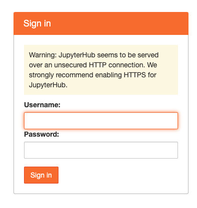
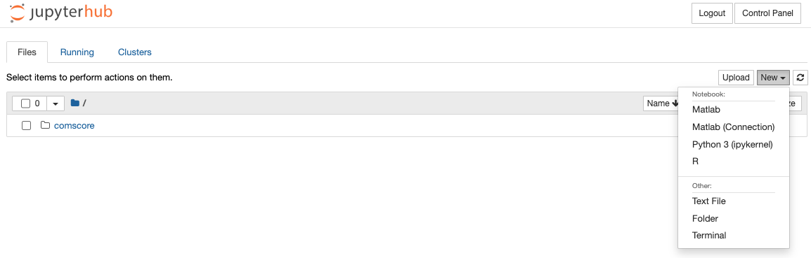
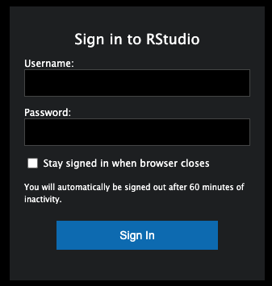

# Server_MKT

## Introduction

This document provides an overview of the Server_MKT specifications and guidelines for accessing and utilizing the software and resources available.

### Specifications

| Component        |                                                      Details |
| ---------------- | -----------------------------------------------------------: |
| Operating System |                                           Ubuntu 22.04.3 LTS |
| RAM              |                                                   257 GB RAM |
| CPU              | Intel® Xeon® Gold 6348 CPU @ 2.60GHz<br>28 cores per socket, 2 sockets, supporting 112 threads |
| Storage          |         `/dev/sdb1/disk1`: 15 TB<br>`/dev/sda1/disk2`: 15 TB |
| GPU              |                                  2 x NVIDIA GeForce RTX 3090 |


## Reminder
The server is a shared resource within our department. While each user will have a private folder and environment, we urge everyone to exercise caution. Please refrain from storing or uploading unsafe resources and from running unverified code. This practice ensures the security and efficiency of the server for all users.
## How to Get Access

**Note:** Access to the server requires connection to the school's wired network and the use of a computer registered with the school.

To obtain access credentials, please fill out the form provided by the administrator.

Form Link: [Google form](https://forms.gle/r1VEWseAbRJziHku6)

## Software

The server provides a suite of software for various computing needs.

### Environment and Packages:

[Google doc](https://docs.google.com/document/d/1T03q5eCnl2ctW3ACA2Iqs5yTH_H2VUOxEfLJL2Zp2sA/edit?usp=sharing)

### Python

#### Basic

**Jupyterhub** is the recommended and most user-friendly platform for running Python files. Access it using the link below with the credentials obtained from the administrator. First-time login will prompt the creation of a user-defined password.

[Log in to Jupyterhub](http://137.189.75.142/hub/login)

#### Advanced Usage

**Command Line:**

Python can be run from the command line using Jupyterhub's terminal or by connecting to the server via SSH.

SSH into the server using the provided admin credentials: `ssh [username]@http://137.189.75.142`, then enter your password.

To use Python in console mode, enter:

```bash
python
```

To run a Python script, use:

```
python file_path
```

##### For Long Duration Tasks

- Utilize the `screen` command in Linux. Note that processes running for more than 24 hours on login nodes may be terminated.

### R

#### Basic

**Jupyterhub** also serves as the recommended platform for running R scripts with similar access procedures as for Python.

[Log in to Jupyterhub](http://137.189.75.142/hub/login)

#### Advanced Usage

**Browser:**

For those who prefer the RStudio interface to Jupyterhub, access it using the system account through the following link:

[Log in to RStudio](http://137.189.75.142:8787/)

**Command Line:**

Alternatively, use SSH and launch R in console mode with:

```
R
```

Run R in batch mode:

```
Rscript file_path
```

### MATLAB

#### Basic

**Jupyterhub** supports MATLAB. Log in using the link below to create a new MATLAB kernel or reference it within a Python file.

[Log in to Jupyterhub](http://137.189.75.142/hub/login)

#### Advanced Usage

**Command Line:**

Use SSH and launch MATLAB in console mode with:

```
bashCopy code
matlab
```

To run your `.m` files:

```
bashCopy code
matlab -r "run('path/to/your_script.m')"
```

### Changing Your Server Account Password

#### Opening the Terminal

Use SSH into the server using the provided admin credentials: `ssh -[username]@http://137.189.75.142`

#### Changing the Password

1. **Enter the Change Password Command**:
   - Type the command `passwd` in the terminal, then press Enter.

2. **Enter Your Current Password**:
   - The system will prompt you to enter your current password. Type it in and press Enter.
   - Note: For security reasons, the characters you type will not be displayed on the screen.

3. **Set Your New Password**:
   - Enter your new password and press Enter.
   - You will be asked to re-enter the new password for confirmation. Type it again and press Enter.
  

### Visual Guides

Below are the visual guides to assist with logging in and using the server's software interfaces:

**JupyterHub Login Interface:**



**Creating or Switching Kernels in JupyterHub:**



**RStudio Login Interface:**



## Questions and Issues

For any server or software-related queries or issues, please utilize the GitHub Issues interface on [this page](https://github.com/YunanOwO/Sever_MKT/issues). You can search for existing issues to find answers or create new ones to post your questions. This approach helps in efficiently tracking and resolving any problems or inquiries.
